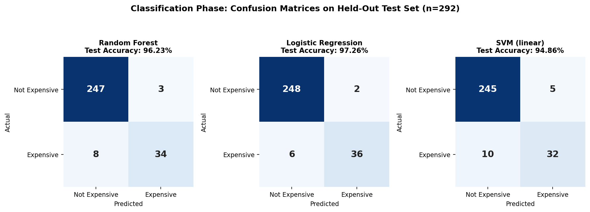
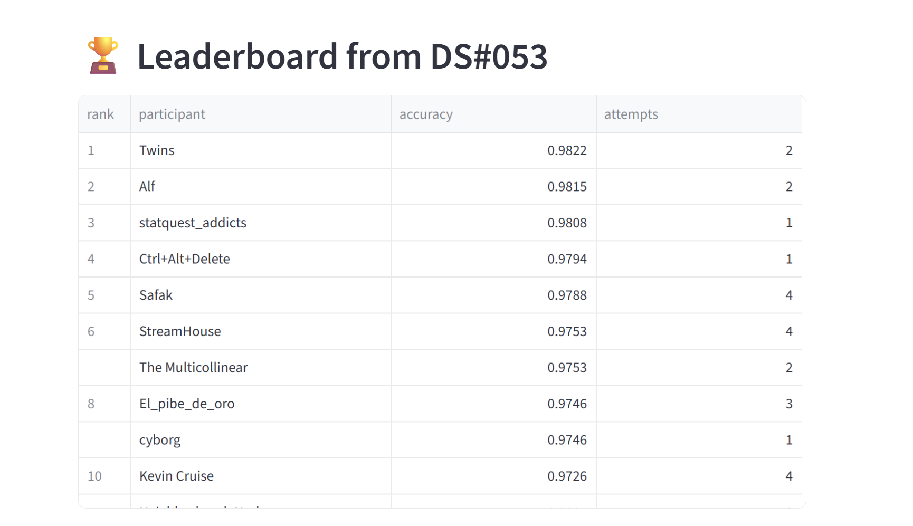

# Ames Housing Price Prediction: Classification & Regression for Real Estate Appraisal
 
## 🎯 Project Overview
 
This project tackles that in two phases on the Ames Housing dataset: classifying homes as **Expensive** or **Not Expensive**, then predicting their **exact sale price**. The classification models ranked **5th (97.88% accuracy)** on the course leaderboard, while the regression phase's **XGBoost** model reached a cross-validated **RMSE of 0.133** on log-transformed price.

## 📊 Dataset & Sources
 
**Source:** Ames Housing dataset, provided by WBS Coding School for two course iterations — one prepared for classification, one for regression.

### Classification phase
- **Size:** 1,460 houses × 79 features (+ binary target `Expensive`) and a separate, unlabeled competition test set of 1,459 houses.
- **Target distribution:** 1,243 Not Expensive vs. 217 Expensive (~14.9% positive class — moderately imbalanced).
- **Key Features Used:** 28 numerical, 20 nominal, 15 ordinal columns after dropping 16 low-signal columns (`MoSold`, `GarageYrBlt`, `LowQualFinSF`, `Electrical`, `BsmtUnfSF`, `BsmtFinSF2`, `BsmtFinType2`, `BsmtFinSF1`, `MasVnrArea`, `Exterior2nd`, `BldgType`, `Condition2`, `LandSlope`, `Utilities`, `LotShape`, `Alley`).
- **Notes:** `MSSubClass` looks numeric but is actually a categorical dwelling-type code, so it was converted to string and one-hot encoded rather than treated as ordinal/numeric.
### Regression phase
- **Size:** 1,460 houses × 79 features + continuous target `SalePrice`, log-transformed (`np.log`) to match the RMSE-on-log(SalePrice) evaluation convention.
- **Key Features Used:** all 79 features retained and encoded — 35 numerical, 28 nominal, 16 ordinal — with the final feature *set* narrowed later per model family (see Feature Selection below), rather than dropped upfront as in the classification phase.

## 🚀 Key Findings & Results
 
### Phase 1 — Classification (Expensive vs. Not Expensive)
 
Three classifiers were trained on identical preprocessing pipelines (mean-imputed numericals, one-hot encoded nominals, explicitly-ordered ordinal encoding) and compared on a 20% held-out test set:
 
| Model | CV Accuracy | Test Accuracy | Recall | Precision | F1 | Cohen's Kappa |
|---|---|---|---|---|---|---|
| Random Forest (GridSearchCV) | 0.9461 | 0.9623 | 0.8095 | 0.9189 | 0.8608 | 0.8391 |
| **Logistic Regression (GridSearchCV)** | 0.9469 | **0.9726** | 0.8571 | 0.9474 | 0.9000 | 0.8842 |
| SVM (linear kernel, GridSearchCV) | 0.9426 | 0.9486 | 0.7619 | 0.8649 | 0.8101 | 0.7806 |
 
- Logistic Regression was the strongest model on the held-out test set across every metric.
- Random Forest's best parameters were `max_depth=10, min_samples_leaf=1, n_estimators=400`;
  SVM's were `C=0.1, kernel="linear", gamma="scale"`;
  Logistic Regression's best regularization strength was `C=1` (scikit-learn's default)
- All models achieve higher precision than recall, indicating they are more conservative when predicting the expensive class. They make relatively few false-positive predictions but miss a larger proportion of truly expensive houses. Given the approximately 15% class imbalance, this behavior is expected. If identifying every expensive property were the business priority, class weighting or decision-threshold tuning would be appropriate next steps.
- The best submission Logistic Regression placed **5th on the WBS Coding School course leaderboard with 97.88% accuracy**, scored on a separate hidden test set via the course's competition app.


### Phase 2 — Regression (Exact Sale Price)
 
Five feature-selection techniques were screened against two fast "proxy" models (Decision Tree and KNN, standing in for the tree-based and distance/linear-based model families respectively) before committing to final models:
 
| Feature Selection Method | Decision Tree R² | KNN R² |
|---|---|---|
| Baseline (no selection) | 0.7789 | 0.7164 |
| Variance Threshold (0.02) | 0.7022 | 0.7218 |
| Variance Threshold (0.001) | 0.7820 | 0.7164 |
| Variance Threshold (0) | 0.7790 | 0.7164 |
| Collinearity Filtering (0.95) | 0.7861 | 0.6949 |
| **Collinearity Filtering (0.90)** | **0.8013** | 0.7114 |
| Collinearity Filtering (0.85) | 0.8007 | 0.7075 |
| SelectKBest (k=30) | 0.7725 | 0.7479 |
| SelectKBest (k=40) | 0.7624 | 0.7350 |
| SelectKBest (k=20) | 0.7297 | 0.8079 |
| SelectKBest (k=10) | 0.7131 | 0.8204 |
| SelectKBest (k=5) | 0.6533 | 0.7845 |
| SelectFromModel (Decision Tree) | 0.7424 | 0.8098 |
| **RFECV (Decision Tree)** | 0.6932 | **0.8498** |
 
- **Collinearity Filtering at a 0.90 correlation threshold** gave the Decision Tree its best result (R² 0.801 vs. 0.779 baseline) by dropping 19 highly redundant columns (229 kept of 248 engineered features).
- **RFECV** gave KNN its best result by far (R² 0.850 vs. 0.716 baseline) — but only by discarding 240 of 248 features, keeping just 8: `GarageCars`, `GrLivArea`, `1stFlrSF`, `TotalBsmtSF`, `YearBuilt`, `OverallQual`, `LotArea`, `BsmtFinSF1`.
- This split decided the final architecture: **tree-based models use the Collinearity-filtered 229-feature set; distance/linear models use the RFECV-selected 8-feature set.**
- Final models, tuned with `GridSearchCV` (5-fold CV, scored on RMSE of log(SalePrice)):

| Model | Feature Set | Best Parameters | CV RMSE (log price) |
|---|---|---|---|
| **XGBoost** | Collinearity-filtered (229 features) | `n_estimators=700, max_depth=3, learning_rate=0.1` | **0.1331** |
| Linear Regression | RFECV-selected (8 features) | — | 0.1786 |

- Takeaway: the "mathematically best" feature count is not one-size-fits-all — KNN's best result came from throwing away 97% of engineered features, while the Decision Tree needed to keep the vast majority of them. XGBoost, trained on the tree-family's feature set, was the clear regression champion.


## 🛠️ Technologies Used
 
- **Programming:** Python
- **Libraries:** pandas, numpy, scikit-learn, xgboost, matplotlib
- **Machine Learning — Classification:** Random Forest, Logistic Regression, Support Vector Machine (SVC), GridSearchCV
- **Machine Learning — Regression:** Decision Tree, KNN, XGBoost, Linear Regression; feature selection via Variance Threshold, Collinearity Filtering, SelectKBest, SelectFromModel, RFECV; GridSearchCV
- **Environment:** Google Colab


 ## 📁 Project Structure
 
```
house-price-prediction-ames/
├── README.md                                          # This file
├── data/
│   ├── housing_iteration_5_classification.csv         # Classification training data (1,460 houses)
│   ├── housing_iteration_5_classification_data_dictionary.txt
│   ├── test_set.csv                                    # Classification competition test set (1,459 houses)
│   ├── housing_iteration_6_regression.csv              # Regression training data (1,460 houses)
│   └── housing_iteration_6_regression_data_dictionary.txt
├── notebooks/
│   ├── classification/
│   │   └── House_classification_models.ipynb           # All 3 classifiers: Random Forest, Logistic Regression, SVM (GridSearchCV)
│   └── regression/
│       └── Regression_house.ipynb                      # Feature selection screening + XGBoost/Linear Regression
└── images/
    ├── leaderboard_ds053.png                           # Course competition leaderboard (5th place, 97.88%)
    ├── classification_confusion_matrices.png           # Confusion matrices for all 3 classifiers
    └── regression_feature_selection_comparison.png     # R² by feature-selection method (DT vs. KNN)
```

## 📈 Visualisations
 

*Confusion matrices for all three classifiers on the 292-row held-out test set. Logistic Regression makes the fewest total errors (8), balancing false positives and false negatives better than the other two models.*
 

*R² for all 14 tested (baseline + feature-selection) configurations, evaluated on both proxy models. The winning method for each model is circled — Collinearity (0.90) for Decision Tree, RFECV for KNN — visually confirming the two models need opposite feature-selection strategies.*
 

*Course-wide competition leaderboard (DS#053) — the classification submission placed 5th among classmates with 97.88% accuracy.*
 
## 🔗 How to Use This Project
 
1. **Classification:** Open `notebooks/classification/House_classification_models.ipynb` — it's self-contained and runs all three models in sequence (data loading → preprocessing → Random Forest → Logistic Regression → SVM, each with its own evaluation and submission file). Logistic Regression has the strongest test-set results.
2. **Regression:** Open `notebooks/regression/Regression_house.ipynb` to see the full feature-selection screening process followed by the final XGBoost and Linear Regression models.
3. **Data:** All datasets are included in `/data`.
4. **Run the Code:** Open any notebook in Google Colab or Jupyter and run all cells top to bottom.
5. **Dependencies:** `pandas`, `numpy`, `scikit-learn`, `xgboost`. No special setup required beyond a standard Python data-science environment.


## 👥 Contact
 
- **Name:** Safak Koclu
- **Email:** [koclusafak@gmail.com](mailto:koclusafak@gmail.com)
- **LinkedIn:** [My LinkedIn Profile](https://www.linkedin.com/in/safak-koclu/)
- **GitHub:** [My GitHub Profile](https://github.com/quasar8)
 

